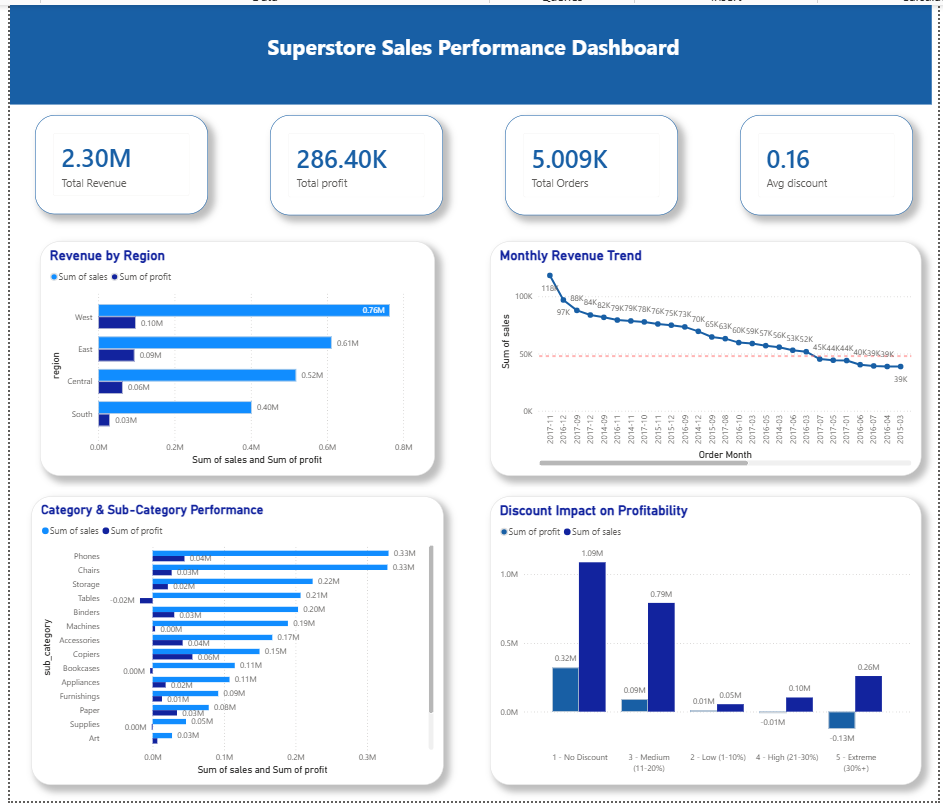

# Superstore Sales Performance Analysis

SQL + Power BI analytics project analyzing 10,000+ retail orders to uncover revenue trends, profitability patterns, and discount impact.

## 📊 Overview
- **Dataset:** 9,994 orders from Superstore (2014-2017)
- **Database:** MySQL with 4 normalized tables
- **Analysis:** 6 SQL queries using JOINs, CTEs, Window Functions, CASE statements
- **Dashboard:** Interactive Power BI dashboard connected live to MySQL

## 💡 Key Findings
- West region generates 52% of total revenue ($725K)
- Discounts above 20% result in negative profit margins
- Top 10 customers account for 15% of revenue
- Monthly revenue shows consistent growth trend

## 📂 Files
- `sql/analysis_queries.sql` — 6 SQL queries
- `outputs/sql_sales_dashboard.pbix` — Power BI dashboard
- `screenshots/dashboard_final.png` — Dashboard preview
- `datasets/Sample - Superstore.csv` — Data file

## 🛠️ Tech Stack
- MySQL (Database design, complex queries)
- Power BI (Live dashboard, drill-down visuals)
- SQL (CTEs, Window Functions, PARTITION BY, CASE statements)

## 📈 Dashboard Features
✅ 4 KPI cards (Revenue, Profit, Orders, Avg Discount)
✅ Revenue by Region (dual-bar chart)
✅ Monthly Revenue Trend (time series)
✅ Category Performance (drill-down capability)
✅ Discount Impact Analysis (profit margin vs discount)

## 🎯 SQL Queries Included
1. Revenue & Profit by Region
2. Month-over-Month Revenue Growth (LAG Window Function)
3. Top 10 Customers by Revenue (RANK)
4. Category & Sub-Category Performance (PARTITION BY)
5. Year-over-Year Growth by Segment (CTE + LAG)
6. Discount Impact on Profitability (CASE statement)

## 📸 Dashboard

---

**Resume Bullets:**
- Designed normalized MySQL database from flat CSV (4 interconnected tables)
- Wrote 6 SQL queries using CTEs, Window Functions, and PARTITION BY to analyze 10K+ transactions
- Built interactive Power BI dashboard connected live to MySQL database
- Identified that discounts above 20% destroy profit margins
